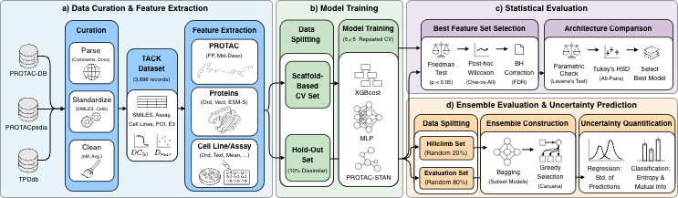

<h1 align="center">TACK</h1>

<h4 align="center"><i>A statistical evaluation of degradation activity on a novel TArgeting Chimeras Knowledge dataset</i></h4>

<p align="center">
  
</p>

TACK combines data from multiple sources (TPDdb, PROTAC-DB, and PROTACpedia) to create the largest publicly available dataset for training and evaluating machine learning models that predict PROTAC-induced protein degradation activities.

[](https://huggingface.co/datasets/ailab-bio/TACK)
[](https://zenodo.org/uploads/15691822)
[](https://arxiv.org/abs/2605.19579)
[](LICENSE)

## 📚 Overview

This repository provides:
- **Curated Dataset**: High-quality PROTAC degradation data with DC50/Dmax measurements
- **Data Curation Pipeline**: Scripts to reproduce the dataset from raw sources
- **Training Framework**: Model training with nested 5×5 cross-validation
- **Ensemble Selection**: Caruana's greedy forward selection with uncertainty quantification
- **Benchmark Suite**: Standardized evaluation protocols and baselines
- **Python API for Ensemble Models**: Pre-trained ensembles for predicting Dmax, DC50, and binary degradation activity

Please refer to the [`tack_dataset/README.md`](tack_dataset/README.md) for detailed instructions on dataset curation, to [`scripts/README.md`](scripts/README.md) for model training and ensemble selection, and to [`notebooks/ensemble_predictor_tutorial.ipynb`](notebooks/ensemble_predictor_tutorial.ipynb) for interactive tutorials on using the pre-trained ensemble predictor.

### Key Features

- ✅ **Multi-source integration** with deduplication and quality control
- ✅ **Scaffold-based data splitting** to prevent information leakage
- ✅ **Rigorous statistical evaluation** via repeated cross-validation
- ✅ **Uncertainty quantification** through ensemble disagreement
- ✅ **Multiple model architectures**: MLP, XGBoost
- ✅ **Hyperparameter optimization** using Optuna

## 🚀 Quick Start

### Installation

TACK uses [`uv`](https://docs.astral.sh/uv/) for environment and dependency management.

**1. Install uv** (skip if already available, e.g., via an HPC module):

```bash
curl -LsSf https://astral.sh/uv/install.sh | sh
# or on HPC: module load uv
```

**2. Clone the repository:**

```bash
git clone https://github.com/ribesstefano/TACK.git
cd TACK
```

**3. Create a virtual environment and install the package:**

```bash
# Core dependencies only
uv venv --python 3.13
source .venv/bin/activate
uv pip install -e .
```

To also install plotting, notebook, and development tools:

```bash
uv pip install -e ".[dev]"
```

**4. (GPU clusters) Install PyTorch with the correct CUDA version:**

GPU computing is generally discouraged, since the models are very small and the performance bottlneck is in data encoding. Nevertheless, if one wishes to train and/or run inference on GPU, replace `cu121` with the CUDA version available on your system (e.g. `cu118`, `cu124`) in the following command:

```bash
uv pip install torch --extra-index-url https://download.pytorch.org/whl/cu121
```

**5. Register the environment as a Jupyter kernel** (only needed for notebooks):

```bash
python -m ipykernel install --user --name tack --display-name "TACK"
```

**6. Set up cache and model files for inference with pre-trained ensembles:**

Please refer to the [README section on "Pre-trained Models & Cache Files"](README.md#pre-trained-models--cache-files) for detailed instructions on downloading and configuring the necessary files for inference.

For running inference with the pre-trained ensemble, please refer to the [ensemble predictor tutorial notebook](notebooks/ensemble_predictor_tutorial.ipynb) for step-by-step instructions on how to use the `EnsemblePredictor` class with the downloaded models and cache files.

### Download the Dataset

The TACK dataset is available on Hugging Face at [this link](https://huggingface.co/datasets/ailab-bio/TACK), it can be accessed via:

```python
from datasets import load_dataset

# Load specific configurations
dmax_ds = load_dataset("ailab-bio/TACK", "Dmax", split="train")
dc50_ds = load_dataset("ailab-bio/TACK", "DC50", split="train")
bin_ds = load_dataset("ailab-bio/TACK", "multitask", split="train")
```

> [!NOTE]
> For reproducibility, training can also be performed using local CSV files via `--custom_dataset_csv`.

## 🗄️ Pre-trained Models & Cache Files

Running inference with a pre-trained ensemble requires two sets of files that
are **not** included in this repository due to their size:

| Archive | Contents | Purpose |
|---|---|---|
| `cache.zip` | `cell2cell_id.json`, `cell2description.json`, `cell2data.json`, `cell_embeddings_model=sentence-transformer_pooling=sum.npz`, `morgan_fp_radius16_size512.npz`, `rdkit_descriptors.npz` | Pre-computed embeddings and molecular descriptors read at inference time |
| `ensembles.zip` | `ensembles/<task>_<type>/ensemble_weights_*.json`, `*_hparams.yaml`, `*_state.pt`, model checkpoints (`.ckpt` / XGBoost `.json`) | Trained ensemble weights and fitted data-processing state |

Both archives are available on Zenodo: **[https://doi.org/10.5281/zenodo.15691822](https://doi.org/10.5281/zenodo.15691822)**

### Setup

**1. Download and unpack the archives:**

```bash
# choose any writable location; this example uses ~/tack-artifacts
mkdir -p ~/tack-artifacts/cache ~/tack-artifacts/ensembles

unzip cache.zip  -d ~/tack-artifacts/cache
unzip ensembles.zip -d ~/tack-artifacts/ensembles
```

**2. Point `TACKAI_CACHE` at the cache directory:**

Copy the example file `.env.example` to `.env` and edit the `TACKAI_CACHE` variable to point to the location of the unpacked cache files:

```bash
cp .env.example .env
# Then edit .env and set:
TACKAI_CACHE=~/tack-artifacts/cache/tack/
```

`tackai` reads this variable at startup via `get_cache_dir()`.  If it is not
set the default falls back to `~/.cache/tackai/`.

**3. Run inference with the pre-trained ensemble:**

See [this tutorial (TODO)](notebooks/README.md).

### What belongs in each archive

The separation between **cache** and **models** is intentional:

- **Cache files** are dataset-wide and shared across all tasks (binary, Dmax,
  DC50).  They are expensive to recompute (ESM protein embeddings, sentence
  embeddings for cell lines) and must exactly match the versions used during
  training.
- **Model files** are task-specific.  Each ensemble folder contains the
  `_hparams.yaml` / `_state.pt` pair for the `DegradationComplexDataModule`
  (which stores fitted scalers and encoders) and the model checkpoints selected
  by Caruana's greedy forward search.

If you retrain models yourself the cache files can be reused as-is; only the
model archive needs to be regenerated.

## 📊 Data Curation

For re-running data curation, please refer to the instruction in this [README](tack_dataset/README.md) file.

## 📂 Repository Structure

```
TACK/
├── configs/               # YAML configuration files
├── data/                  # Processed dataset files
├── logs/                  # Log files from training
├── misc/                  # Images and miscellaneous files
├── notebooks/             # Jupyter notebooks for exploration
├── predictions/           # Model predictions on CV splits
├── protac_stan/           # PROTAC-STAN reproduction scripts
├── scripts/               # Training and ensemble scripts
├── ensemble_results/      # Ensemble selection results
├── pyproject.toml         # Package metadata and dependencies (uv)
└── README.md
```

## 📈 Reproducing the Results

### Train a Model

Training is configured with [Hydra](https://hydra.cc). A run is composed from
`configs/train.yaml` by selecting a feature set (`data=`, any file stem under
`configs/data/`) and a model (`model=`, any file stem under `configs/model/`),
then overriding any field on the command line:

```bash
# Single run (Hydra compose API)
tack train model=xgboost data=fp task=dmax group=scaffold
```

To change the configuration, override leaves inline (e.g.
`model.model_config.learning_rate=0.005 batch_size=128 tune_hyperparameters=false`)
or edit `configs/train.yaml` and the group files under `configs/data/` and
`configs/model/` directly. The model type is read from each model config's
`model_type` field, so it no longer needs to be passed separately.

Every run writes a **manifest** under `<checkpoint_dir>/manifests/<run_id>.json`
recording the exact config, feature set, and per-fold artifacts — see
[Experiment Structure](#experiment-structure) below.

#### Sweeping Over Configurations (Hydra Multirun)

For sweeps, use `tack sweep` (the `tack-sweep` console script), which drives
Hydra's launcher with `-m`/`--multirun` and comma-separated value lists. Each
combination runs as its own experiment and writes its own manifest:

```bash
# Cartesian product: 2 models × 2 feature sets × 2 tasks = 8 runs
tack sweep -m model=xgboost,mlp data=fp,simple task=dmax,dc50 group=scaffold

# Sweep a DataModule leaf (e.g. fingerprint size)
tack sweep -m model=xgboost data=fp task=dmax data.fp_size=512,1024

# Inspect the merged config without training
tack sweep --cfg job
```

#### Overriding DataModule Parameters via the Command Line

All fields defined in a `configs/data/*.yaml` file can be overridden directly on
the command line using the `data.` prefix (single value per key for `tack train`;
comma lists for `tack sweep`).

```bash
# Change fingerprint size and radius for a single run
tack train model=xgboost data=fp task=dmax data.fp_size=1024 data.radius=2

# Switch from minmax to one-hot encoding of categorical features
tack train model=xgboost data=fp task=dmax data.categorical_encoding=onehot

# Disable label normalisation on-the-fly (useful for debugging raw outputs)
tack train model=xgboost data=fp task=dmax data.normalize_labels=false

# Use a local CSV instead of the Hugging Face dataset
tack train model=xgboost data=fp task=dmax custom_dataset_csv=./my_data.csv

# Use a precomputed protein embedding file and enable PCA reduction
tack train model=xgboost data=cell_text_esms task=dmax \
    data.poi_embeddings_file=/path/to/embeddings.npz \
    data.poi_embeddings_per_residue=false \
    data.poi_pca_n_components=32

# Sweep a leaf across values with the multirun launcher
tack sweep -m model=xgboost data=fp task=dmax data.categorical_encoding=minmax,onehot,embedding
```

The full list of overridable `data.*` keys matches the parameters of
`DegradationComplexDataModule.__init__` and is explicitly listed in each YAML
file under `configs/data/`.

### Experiment Structure

Training is harmonized around a per-run **manifest**, the single structured
source of truth for an experiment (one `(model, data, task, group)` combination).
This replaces reverse-parsing information out of filenames.

```text
<checkpoint_dir>/
├── manifests/
│   └── <run_id>.json          # structured record (see below)
├── model=<name>-group=<g>-fold=<k>.{json,ckpt}    # per-fold checkpoints
└── datamodule-data=<...>-fold=<k>_{hparams.yaml,state.pt}   # fitted state
<predictions_dir>/
└── preds-model=<...>-task=<t>-group=<g>-fold=<k>-split=<val|test>.csv
```

The `run_id` is a deterministic slug `model__data__task__group`
(e.g. `xgboost__fp__dmax__scaffold`). Each manifest records:

- the canonical Hydra `model=`/`data=` stems and the **resolved** config /
  optimized hyperparameters;
- a human-readable `label` (e.g. `XGB-DMAX Cell-Text E3-OneHot Mol-Desc Time`);
- the **feature spec** — each processed feature tagged `stateless` vs `fitted`
  (see below);
- per fold: the checkpoint, datamodule-state, and prediction-file paths;
- provenance (timestamp, `tackai` version, git SHA).

#### Stateless vs fitted features

Each processed feature is declared (in `tackai.data.datamodule.FEATURE_REGISTRY`,
surfaced per-config via `DegradationComplexDataModule.get_feature_spec()`) as
either **stateless** — deterministic per input and cached once in `TACKAI_CACHE`,
so it is computed a single time and reused across every fold and ensemble member —
or **fitted** — produced by an estimator fit on the training fold and therefore
recomputed per fold.

| Feature | Flag | Kind |
|---|---|---|
| Morgan fingerprints | `use_fingerprints` | stateless (cached) |
| RDKit descriptors | `use_descriptors` | stateless (cached)¹ |
| POI / E3 precomputed ESM embeddings | `use_poi_precomputed_embedding`, `use_ligase_precomputed_embedding` | stateless (cached) |
| Cell-line description embeddings | `use_cell_description_embedding` | stateless (cached) |
| POI / E3 / cell-line name encoders | `use_*_name_embedding` | fitted (per fold) |
| POI sequence count vector | `use_poi_sequence_embedding` | fitted (per fold) |
| Assay type / treatment time | `use_assay_type_encoding`, `use_treatment_time` | fitted (per fold) |
| PCA on ESM embeddings | `use_poi_pca`, `use_ligase_pca` | fitted (per fold) |

¹ Raw descriptor values are cached and reused; they then pass through the
(cheap) fitted numeric scaler.

### Evaluate Models

`tack evaluate` runs the whole statistical comparison in one go: it discovers
runs (preferring manifests, falling back to the canonical filename parser),
loads every fold's predictions into one tidy table, ranks methods per task with
the [`autorank`](https://github.com/sherbold/autorank) package (automatic
parametric/non-parametric choice, multiple-comparison correction, and a
critical-difference diagram), and writes a Markdown report plus figures.

```bash
tack evaluate \
    --predictions-dir ./predictions \
    --checkpoints-dir ./checkpoints \
    --task dmax --set val \
    --output-dir ./eval_results
```

Outputs in `--output-dir`: `report.md` (best + statistically-equivalent methods
per task, ranking table, figures), `runs.csv`, `ranking.csv`, `metrics.csv`, and
a `figures/` directory (CD diagrams, metric boxplots, ROC/PR curves). The
labeling/loading/ranking helpers are importable for notebooks via
`from tackai.evaluation import load_predictions, find_equivalent_best_set, build_full_report`.
Requires the analysis extras (`uv pip install -e ".[dev]"`).

### Construct and Evaluate Ensemble

```bash
python scripts/ensemble_comparison.py \
    --task dmax \
    --prediction_dir ./predictions \
    --output_dir ./ensemble_results
```

### Predict with the `tack` CLI

Run weighted ensemble inference on a CSV of PROTACs. The input CSV **must**
contain a `SMILES` column; optional context columns are used when present.

```bash
tack predict \
    --checkpoints-dir ensembles/dmax \
    --weights ensemble_weights_dmax_caruana_ensemble.json \
    --input-csv compounds.csv \
    --output-csv predictions.csv
```

**`tack train` overrides** (Hydra `key=value`; defaults from `configs/train.yaml`):

| Override | Description | Default |
|---|---|---|
| `model` | Model config stem under `configs/model/` | `xgboost` |
| `data` | Feature-set config stem under `configs/data/` | `fp` |
| `task` | `dmax` / `dc50` / `bin` / `dmax_bin` / `dc50_bin` / `multitask` | `dmax` |
| `group` | Split strategy: `random` / `scaffold` / `butina` | `scaffold` |
| `batch_size`, `seed`, `num_proc` | Run settings | `64`, `42`, `1` |
| `tune_hyperparameters`, `n_tuning_trials` | Optuna tuning | `true`, `null` (→ 20 xgb / 100 nn) |
| `checkpoint_dir`, `predictions_dir` | Output directories | `./checkpoints`, `./predictions` |
| `custom_dataset_csv` | CSV overriding the TACK dataset | `null` |

**`tack predict` arguments:**

| Argument | Description | Default |
|---|---|---|
| `--checkpoints-dir` | Directory with model checkpoints + datamodule states (**required**) | — |
| `--input-csv` | Input CSV with a `SMILES` column (**required**) | — |
| `--output-csv` | Where to write predictions (**required**) | — |
| `--weights` | Ensemble weights JSON; restricts inference to the listed models | all models |
| `--device` | `cuda` / `cpu` | auto |
| `--n-jobs` | Threads for XGBoost inference | all cores |
| `--smiles-col` | SMILES column name | `SMILES` |
| `--poi-col`, `--poi-sequence-col`, `--ligase-col`, `--cell-line-col`, `--treatment-time-col` | Context column overrides | auto-detected |

Recognized optional input columns (auto-detected when not given): `POI_Name`,
`POI_Sequence`, `Ligase_Name`, `Cell_Line_ID`/`Cell_Line`, `Assay_Time`. The
output CSV appends `prediction`, `uncertainty`, and percentile/SEM 95%
confidence-interval columns (suffixed per task when the ensemble spans multiple
tasks).

### 🧬 PROTAC-STAN Evaluation

See the [PROTAC-STAN evaluation instructions](protac_stan/README.md) for reproducing results on TACK with 5×5 cross-validation.

## 📄 License

The TACK dataset and code are released under the MIT License. See `LICENSE` for details.

<!-- Add citation -->

## 📑 Citation

If you use TACK in your research, please cite the following paper:

```bibtex
@misc{ribes2026tackstatisticalevaluationdegradation,
      title={{TACK: A statistical evaluation of degradation activity on a novel TArgeting Chimeras Knowledge dataset}}, 
      author={Stefano Ribes and Nils Dunlop and Rocío Mercado},
      year={2026},
      eprint={2605.19579},
      archivePrefix={arXiv},
      primaryClass={q-bio.QM},
      url={https://arxiv.org/abs/2605.19579}, 
}
```

## 🤝 Acknowledgements

The authors acknowledge funding provided by the Chalmers Gender Initiative for Excellence (Genie), and by the Wallenberg AI, Autonomous Systems, and Software Program (WASP), supported by the Knut and Alice Wallenberg Foundation.
The authors thank Yossra Gharbi, Alexander Persson, and Felix Erngård for helpful discussions.
The computations and data storage were enabled by resources provided by Chalmers e-Commons and by the National Academic Infrastructure for Supercomputing in Sweden (NAISS), partially funded by the Swedish Research Council through grant agreement no. 2022-06725.
